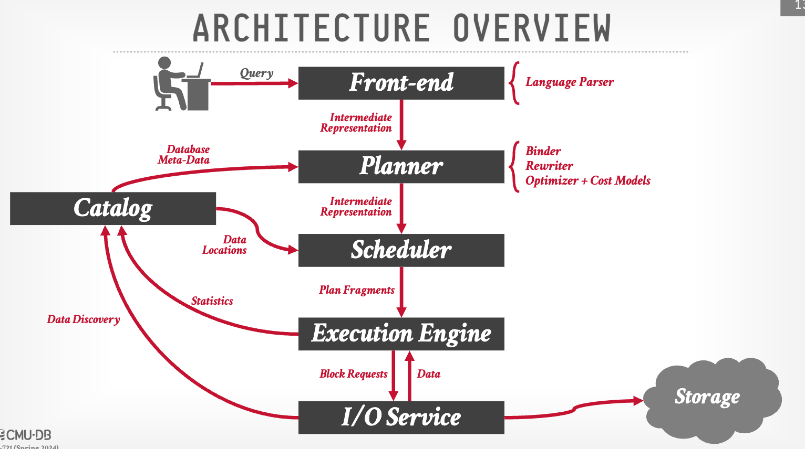

## _Lecture Note_ 01. Modern Analytical Database Systems

### History

1. Data Cube ('90s)

   DBMSs maintain pre-computed aggregations to speed up queries.

1. Data Warehouses ('00s)

   - Monolithic DBMSs
   - Shared-nonthing architectures
   - Column-oriented data storage
   - ETL data from OLTP databases into OLTP database

1. Shared-Disk Engines ('10s)

   - Shared-disk architectures
   - Third-party distributed storage instead of custom storage manager
   - OLTP databases store data in object store (with catalog manager); OLAP query engine fetches data from that

1. Lakehouse Systems ('20s)

   - SQL as well as non-SQL
   - decoupling data storage from DBMS
   - Unstructured / semi-structured data

### Components

- System Catalogs
- Intermediate Representation
- Query Optimizers
- File Format
- Access Libraries
- Execution Engines / Fabrics

### (Distributed) Architecture

Distributed OLAP query execution is roughly the same as that on single node.
For each operator the DBMS considers where to fetch the input and where to send the output.

- Persistent Data & Intermediate Data
- Push Query to Data vs. Pull Data to Query
- Shared-Nothing vs. Shared-Disk

  - Shared-Nothing
    - Harder to scale capacity
    - Better performance & efficiency (potentially)
    - Filtering data before transferring
  - Shared-Disk
    - Scalable compute layer
    - Not pay for idle compute nodes
    - No filtering before pulling (more and more supports now)

  Most OLAP DBMSs today uses the shared-disk architecture because of object stores (cheaper and infinitely scalable). Caching can reduce the performance lost.
