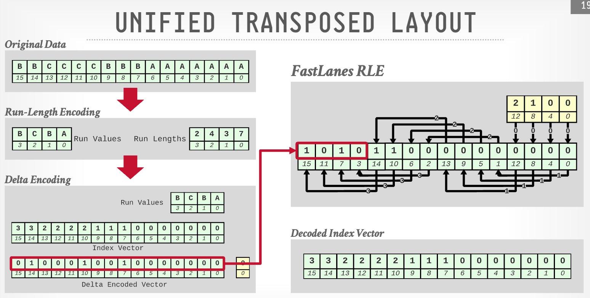
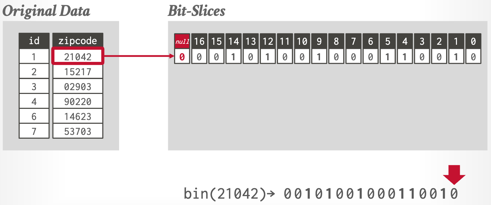
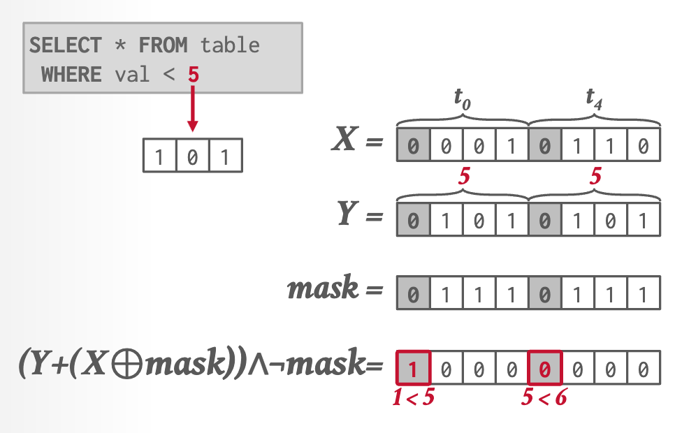

## _Lecture Note_ 03. Data Formats & Encoding II

_I try to read the papers before class, but it's hard to understand (FastLane in particular). I decide to watch the video first but just to find this lecture is mainly about that 3 papers...😅 Thus this note will just simply cover the main idea._

### Nested Data Representation (from last class)

1. Shredding
1. Length + Presence

### Critiques of Existing Formats

- Variable-sizes runs is _not_ SIMD friendly.
- No random access if using block compression.
- Dependencies between adjacent values.
- Not designed for SIMD of all ISAs.

### The Ideas from Papers

The ideas from the 3 papers to solve these challenges:

- **_BtrBlocks_**

  To select a better encoding scheme, sample values from column, try out all viable encoding schemes, and repeat three times.

  Among the encoding schemes:

  - _FSST_ Replace frequently occurring substrings with 1-byte codes.
  - _Roaring Bitmaps_ Use a hierarchical bitmap (like page table in kernel). Bitmap for dense chunks; array for sparse chunks.

- **_FastLanes_**

  Reordering data layout to achieve parallelism.

  

- **_BitWeaving_**

  Implement "short-circuit" comparisons in integer type using CPU instructions (capable of extendind to SIMD).

  The integer stores in _bit-sliced_ encoding, where a logical integer column is stored as multiple bit columns (physically).

  

  Employ bit hack to perform prediction using SIMD instructions.

  

  

### Lesson Learned

**Logical-physical data independence** allows hacking on physical representation/computation without logical interfaces changed.

Data parallelism via SIMD is an important tool.
