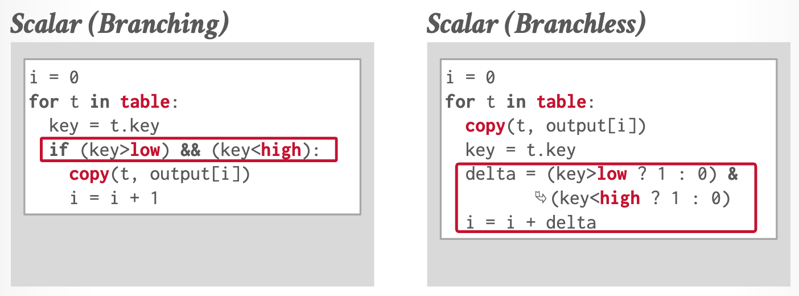
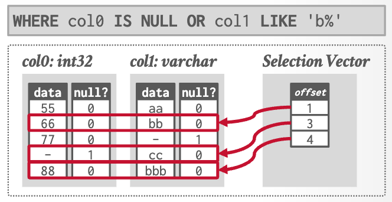

I request for my privilege to miss the reading review for _MonetDB/X100_ paper, since Andy said most OLAP DBs today followed the guidelines in that paper (no suprise, this paper is as old as me).

## _Lecture Note_ 04. Query Execution & Processing I

DBMS engineering is an orchestration of a bunch of optimizations and not a single one is more important than the others.

Overview optimization goals:

- **Reduce Instruction Count**. Compiler optimizations, better coding.
- **Reduce Cycles per Instruction**. Branchless, SIMD, dependent-free.
- **Parallelize Execution**.

### MonetDB/X100 Analysis

Modern CPUs organize instructions into pipeline stages and support multiple pipelines. The problems in DBMS are (1)dependencies in instruction and (2)branch misprediction.

Example solutions:

- Branchless selection scans.

  

- Excessive instructions. No big switch table.

### Processing Models

Processing model = control flow + data flow.

- Iterator Model (Volcano / Pipeline Model)

  `op.next()` returns one tuples at a time.

- Materialization Model

  `op.output()` returns the whole result set.

- Vectorized / Batch Model

  `op.next()` returns a _batch_ of tuples. Ideal for OLAP queries.

### Plan Processing Direction

- Top-to-Bottom (Pull)
- Bottom-to-Top (Push)

  More in HyPer system next week.

### Filter Representation

- Selection Vectors

  

- Bitmaps

  

Vectorized / bottom-up execution almost always will be the better way to execute OLAP queries.
