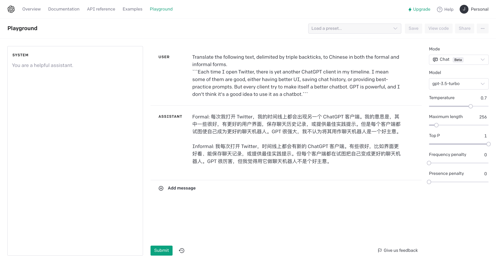

Use OpenAI's [Playground](https://platform.openai.com/playground?mode=chat) instead.

## Introduction

Each time I open Twitter, there is yet another ChatGPT client in my timeline. Some of them are excellent, with better UI, chat history saving, or best-practice prompts. However, each client tries to make itself a better chatbot. GPT is powerful, but I don't think it's a good idea to use it as a chatbot.

## Bad Pratice

In my humble opinion, chatbot-like UI confuses people into thinking that it is a chatbot rather than a text model.

1. "Continue"

   Due to the maximum length limitation, ChatGPT can only answer 256 tokens at once. Sometimes the answer doesn't finish yet, and the user needs to type "Continue" to get the rest of the answer. But this corrupts the context, and the answer is no longer coherent.

2. Using more dialogue to correct misundertanding

   ChatGPT might not understand you well on the first attempt. The user says "No, I mean..." to correct the misunderstanding. Again, this corrupts the context, and the answer is usually worse than starting another dialogue with more context.

   Moreover, it consumes more tokens since the user inputs the misunderstanding repeatedly. (Remember that GPT will eat all the previous dialogue each time)

3. Asking ChatGPT about itself

   I have read blogs that teach people to ask ChatGPT about itself. For example, ask "Do you remember what I said?" and delete the earliest dialogue to reduce the context length. I truly don't believe that it works.

## Playground

OpenAI provides a better platform called playground to use its model. For me, the most important features are:

1. Control the parameters, such as temperature, top-p, and frequency penalty.

2. Continue without corrupting the context.

   When the answer is unfinished, click submit again to continue the answer. This is much better than typing "Continue" in the chatbot-like UI.

3. Edit the dialogue.

   When the answer is not good, I can edit the dialogue, provide more context, and ask again. Note that I can even edit the answer so that GPT will emulate my style to give a more coherent answer. (Always remember GPT is a text model)

## The Best GPT Client

Python Jupyter.

Most of the time the most convenient way to use GPT is just to use raw API. It's the same powerful as playground. And you can combine it with other [APIs](https://platform.openai.com/docs/api-reference) of OpenAI, e.g. `whisper-1` for audio transcription. I [write](https://github.com/qsliu2017/OpenAI-Playground) some helper functions and prompts in Jupyter notebook to make it more convenient.

## Conclusion

The chatbot-like UI is the most important reason ChatGPT has become so popular. But from my point of view, GPT is an advanced text model more than a strong AI. Thus, we should treat it as a text model rather than a chatbot, use OpenAI's Playground to get the best out of GPT.
