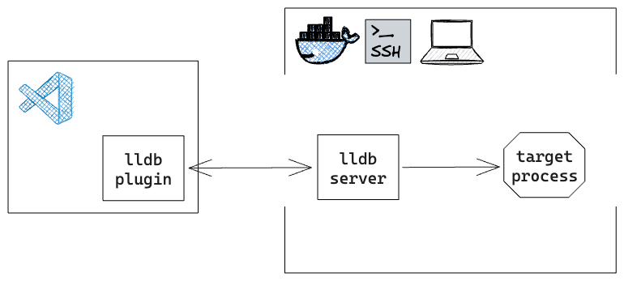

## TL;DR

1. Install VSCode plugin [`Remote Development`](https://marketplace.visualstudio.com/items?itemName=ms-vscode-remote.vscode-remote-extensionpack) (be it container or SSH), and install [`LLDB DAP`](https://marketplace.visualstudio.com/items?itemName=llvm-vs-code-extensions.lldb-dap) in the remote environment
2. Install `lldb` in source code environment
3. Build the project with debug symbols
4. Configure `.vscode/launch.json`
   ```json
   {
   	"version": "0.2.0",
   	"configurations": [
   		{
   			"type": "lldb-dap",
   			"request": "launch",
   			"name": "Launch",
   			"program": "${workspaceRoot}/<your program>",
   			"args": [],
   			"env": [],
   			"cwd": "${workspaceRoot}"
   		}
   	]
   }
   ```

## Explained

Modern debuggers employ client/server architecture to provide debugging features. The architecture is shown below, using `lldb` as an example.



The debugger client (e.g. VSCode) sends commands to the debugger server (e.g. `lldb`) and receives the results. The debugger server interacts with the target program and provides the results back to the client. Then the debugger client displays the results to the user.

`lldb` is a debugger for C/C++, based on the LLVM project. To debug a program with `lldb`, you need to build the program with debug symbols.
